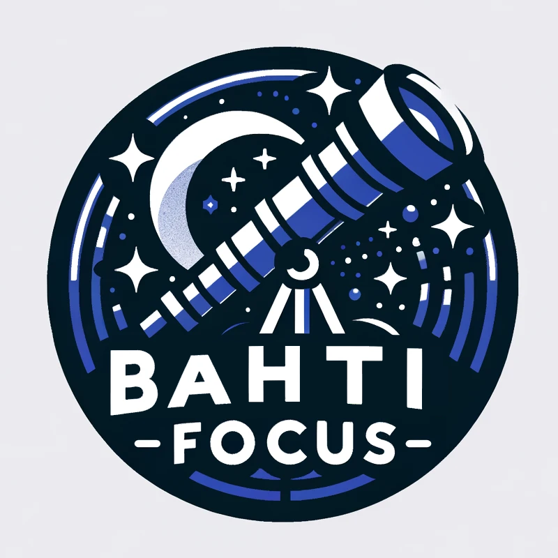

# BahtiFocus - Bahtinov Mask Analyzer

**BahtiFocus** is a precision Bahtinov mask analyzer integrated into [N.I.N.A](https://nighttime-imaging.eu/), designed to help astronomers achieve perfect focus for their telescopes effortlessly.

## Requirements

- [N.I.N.A 3.0](https://nighttime-imaging.eu/2024/03/18/n-i-n-a-3-0/)
- A connected camera (see [N.I.N.A documentation](https://nighttime-imaging.eu/docs/master/site/quickstart/equipment/))

## Features

- Continuously take photos.
- Analyze each photo to monitor:
    - Focus error (in pixels)
    - Absolute focus error (in microns)
    - Critical focus
    - Mask angle
    - Line angles

## Usage

- Install the plugin automatically with the N.I.N.A plugin manager or manually place the DLL file into `%localappdata%\NINA\Plugins`.
    - A new panel will appear in the `Imaging` tab called `Bahtinov Analyser`.

- Create or purchase a Bahtinov mask for your instrument (see [Bahtinov section](#bahtinov-mask)).
- Connect your camera to N.I.N.A.
- Choose, slew, and center a star in your camera's view.
    - If the star isn't bright enough, the lines created by the Bahtinov mask will not be visible.
- Place the Bahtinov mask on your instrument.
- Set the options in the `options` toolbar of the `Bahtinov Analyser` for exposure time, filters, etc.
    - **Note**: Information is taken from N.I.N.A options, such as focal length from `Options > Equipment`.
- Press the start button to begin the exposure.
- After the first photo is taken and appears on the right, you will see a rectangle on the right side of the screen.
    - The rectangle indicates the area analyzed on the left. You can move or zoom it using the controls at the bottom to center it on the star.

- The analysis will continue automatically, and you can adjust the focus of your instrument to find the critical focus.
- Once the critical focus is achieved, you can stop the process and remove the Bahtinov mask!

## Bahtinov Mask

A Bahtinov mask is a device used in astrophotography to achieve precise focus on stars or other celestial objects. It is a piece of material with a specific pattern of slots or lines that creates diffraction spikes when placed in front of the telescope's objective lens or primary mirror.

### What Does it Do to the Photo?

When a Bahtinov mask is placed in front of the telescope, it creates a pattern of diffraction spikes on a star image. These spikes form an X shape with a central spike that shifts position based on the focus. By analyzing the position of this central spike relative to the X shape, astrophotographers can determine if the focus is perfect, too close, or too far.

### How to Use a Bahtinov Mask

1. **Attach the Mask**: Place the Bahtinov mask over the front of your telescope or camera lens.
2. **Select a Bright Star**: Point your telescope at a bright star to ensure the diffraction spikes are clearly visible.
3. **Capture an Image**: Take a photo of the star using your camera.
4. **Analyze the Diffraction Spikes**: Look at the image and observe the pattern of the diffraction spikes.
    - If the central spike is perfectly centered between the other spikes, the focus is accurate.
    - If the central spike is offset, adjust the focus accordingly.
5. **Adjust Focus**: Slowly adjust the focus of your telescope or lens until the central spike is perfectly centered.
6. **Remove the Mask**: Once the focus is accurate, remove the Bahtinov mask and proceed with your astrophotography session.

### How to Create a Bahtinov Mask

You can buy a Bahtinov mask from various retailers, such as [Pierro Astro](https://www.pierro-astro.com/recherche/results,1-20?keyword=masque+de+bahtinov&option=com_virtuemart&view=category&limitstart=0&virtuemart_category_id=0&Itemid=2540).

You can also 3D print the Bahtinov mask using PLA plastic or create it using cardboard and a cutter. There are many resources available online to guide you through different methods. A useful website: https://skeye.rocks/tools/mask/

